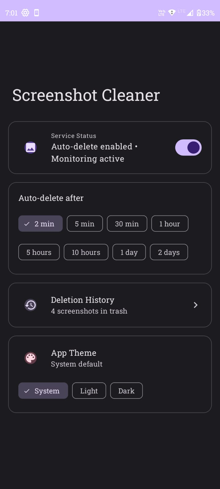
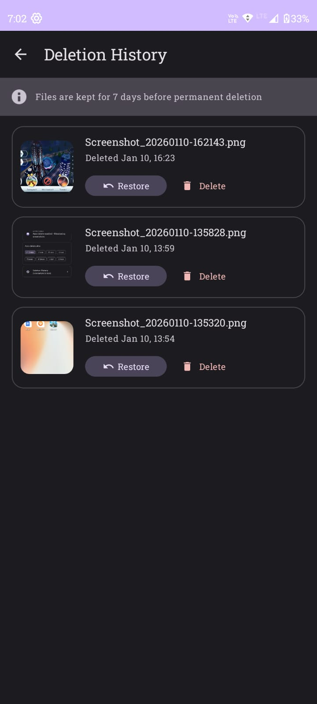
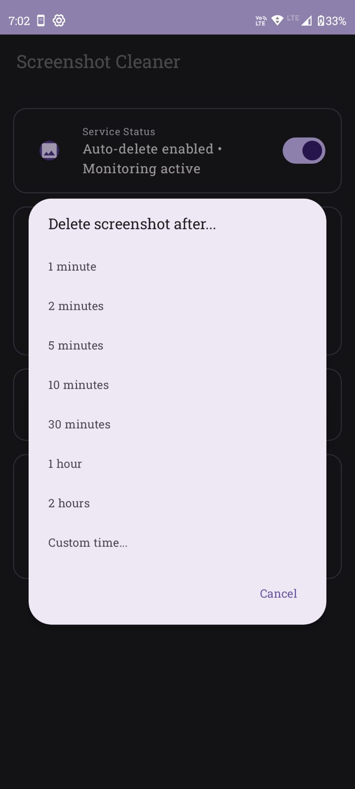

# 📱 Screenshot Cleaner

### *Clear the Clutter*

> *"Why do I have 847 screenshots?!"*

---

## The Problem We've All Faced

Have you ever opened your gallery and stumbled upon your Screenshots folder, only to find hundreds—maybe thousands—of images you completely forgot about?

That QR code from 3 months ago. A screenshot of an address you visited once. A meme you meant to share but never did. An OTP that expired 6 months ago. A screenshot of a conversation you don't even remember having.

**Sound familiar?**

We take screenshots for *moments*—quick references, temporary saves, things we need for just a few minutes or hours. But we never delete them. And slowly, silently, they pile up. Eating storage. Cluttering our galleries. Making it impossible to find the photos that actually matter.

I found myself spending 30 minutes one Sunday just cleaning up screenshots. And I thought:

*"Why am I doing this manually? I knew I didn't need most of these the moment I took them."*

That's when **Screenshot Cleaner** was born.

---

## 💡 The Idea

What if screenshots could clean themselves?

What if, the moment you take a screenshot, you could decide: *"I'll need this for 5 minutes"* or *"Delete this in an hour"*—and then forget about it completely?

No more manual cleanup. No more storage guilt. No more scrolling through hundreds of useless images.

**Screenshot Cleaner** does exactly that.

---

## ✨ How It Works

### 1️⃣ Take a Screenshot
Just take a screenshot like you normally would. Screenshot Cleaner is watching (in a friendly way 👀).

### 2️⃣ Get a Notification
Instantly, you'll see a notification:
```
📸 Screenshot captured
Will delete in 5 minutes
[Cancel]  [Edit Time]
```

### 3️⃣ Choose Your Fate
- **Do nothing** → Screenshot auto-deletes after your set time
- **Tap "Cancel"** → Screenshot is saved forever
- **Tap "Edit Time"** → Choose when to delete (1 min, 5 min, 30 min, 1 hour, or custom)

### 4️⃣ It's Gone (But Not Really)
When the timer ends, the screenshot is deleted from your gallery. But don't worry—it's moved to a **7-day trash** where you can restore it if you change your mind.

### 5️⃣ Restore Anytime
Made a mistake? Open the app, go to **Deletion History**, tap the screenshot, and hit **Restore**. It's back in your gallery like nothing happened.

---

## 🎯 Features

| Feature | Description |
|---------|-------------|
| 🔔 **Smart Notifications** | Cancel or edit delete time right from the notification |
| ⏱️ **Flexible Timers** | 2 min, 5 min, 30 min, 1 hour, 5 hours, 10 hours, 1 day, 2 days, or custom |
| 🗑️ **7-Day Trash** | Deleted screenshots can be restored within 7 days |
| 👀 **Preview & Restore** | Full-screen preview of deleted screenshots before restoring |
| 🌙 **Dark Mode** | Supports light, dark, and system theme |
| 🔄 **Background Service** | Works even when the app is closed |
| 🚀 **Auto-Start** | Starts monitoring on device boot |
| 🎨 **Material You** | Beautiful Material 3 design |

---

## 📱 Screenshots

<table>
  <tr>
    <td align="center">
      
      <br/>
      <b>Home Screen</b>
    </td>
    <td width="2%"></td>
    <td align="center">
      
      <br/>
      <b>Deletion History</b>
    </td>
    <td width="2%"></td>
    <td align="center">
      
      <br/>
      <b>Edit Delete Time</b>
    </td>
  </tr>
</table>

---

## 🚀 Getting Started

1. Clone the repository
```bash
https://github.com/Kamboji-Akhilesh/Screenshot-Cleaner.git
```

2. Open in Android Studio

3. Build and run on your device

4. Grant necessary permissions

5. Take a screenshot and watch the magic happen! ✨

---

## 🎨 Customization

### Default Delete Time
Open the app and select your preferred default time:
- 2 minutes (great for OTPs)
- 5 minutes (quick references)
- 30 minutes (short-term needs)
- 1 hour to 2 days (longer references)

### Theme
Choose between:
- 🌙 Dark Mode
- ☀️ Light Mode  
- 📱 System Default

---

## 💭 Philosophy

> "The best screenshot is the one you don't have to think about deleting."

Screenshot Cleaner is built on the principle of **intentional defaults**. Most screenshots are temporary by nature—we just treat them as permanent because deleting is inconvenient.

By flipping the default from "keep forever" to "delete after X minutes," we align with how we actually use screenshots.

And with a 7-day safety net, there's no fear of losing something important.

---

## 🤝 Contributing

Contributions are welcome! Feel free to:
- Report bugs
- Suggest features
- Submit pull requests

---

## 🙏 Acknowledgments

Built with ❤️ for everyone who's ever said:
> *"I really need to clean up my screenshots folder..."*

Now you don't have to.

---

**Screenshot Cleaner** - *Clear the Clutter* ✨

